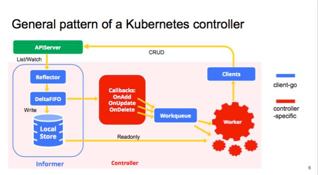

# CRD

CRD是一个内建的API, 它提供了一个简单的方式来创建自定义资源。
部署一个CRD到集群中使Kubernetes API服务端开始为你指定的自定义资源服务。

这使你不必再编写自己的API服务端来处理自定义资源，但是这种实现的一般性意味着比你使用API server aggregation缺乏灵活性。

如果只是想添加资源到集群，可以考虑使用 customer resource define，简称CRD，CRD需要更少的编码和重用，
在[这里](https://kubernetes.io/docs/concepts/api-extension/custom-resources)阅读更多有关自定义资源和扩展api之间的差异

# 创建CRD

```
cat > EOF | kubectl create -f 
apiVersion: apiextensions.k8s.io/v1beta1
kind: CustomResourceDefinition
metadata:
  name: podtoips.example.com
spec:
  group: example.com
  version: v1
  scope: Namespaced
  names:
    plural: podtoips
    singular: podtoip
    kind: Podtoip
    shortNames:
    - ptp
EOF
```

# controller逻辑

controller 一般会有 1 个或者多个 informer，来跟踪某一个 resource，
跟 APIserver 保持通讯，把最新的状态反映到本地的 cache 中。
只要这些资源有变化，informal 会调用 callback。
这些 callbacks 只是做一些非常简单的预处理，把不关心的的变化过滤掉，
然后把关心的变更的 Object 放到 workqueue 里面。
其实真正的 business logic 都是在 worker 里面， 
一般 1 个 Controller 会启动很多 goroutines 跑 Workers，
处理 workqueue 里的 items。它会计算用户想要达到的状态和当前的状态有多大的区别，
然后通过 clients 向 APIserver 发送请求，来驱动这个集群向用户要求的状态演化。
图里面蓝色的是 client-go 的原件，红色是自己写 controller 时填的代码



# controller 

下面是我实现的一个简单的 poptoip controller 

```
package main

import (
	"flag"
	"k8s.io/client-go/kubernetes"
	"k8s.io/client-go/rest"
	"k8s.io/client-go/tools/clientcmd"
	"k8s.io/apimachinery/pkg/runtime/schema"
	"k8s.io/apimachinery/pkg/runtime/serializer"
	"k8s.io/apimachinery/pkg/runtime"
	metav1 "k8s.io/apimachinery/pkg/apis/meta/v1"
	"k8s.io/client-go/tools/cache"
	utilruntime "k8s.io/apimachinery/pkg/util/runtime"
	"k8s.io/client-go/util/workqueue"
	"time"
	v1 "k8s.io/api/core/v1"
	"k8s.io/apimachinery/pkg/fields"
	"fmt"
	"k8s.io/apimachinery/pkg/util/wait"
	"log"
	"k8s.io/client-go/kubernetes/scheme"
)
func init(){
	log.SetFlags(log.Lshortfile)
}
func main(){
	kubeconfig := flag.String("kubeconfig", "./kubeconfig", "Path to a kube config. Only required if out-of-cluster.")
	flag.Parse()
	pic:=newPodipcontroller(*kubeconfig)
	var stopCh <-chan struct{}
	pic.Run(2, stopCh)
}

type Podipcontroller struct {
	kubeClient *kubernetes.Clientset
	crdclient  *Podipclient

	podStore cache.Store
	//cache.AppendFunc
	podController cache.Controller
	podtoip        *PodToIp
	podsQueue      workqueue.RateLimitingInterface
}

func (p2p *Podipcontroller) Run(workers int, stopCh <-chan struct{}) {
	defer utilruntime.HandleCrash()

	fmt.Println("Starting Controller")
	//p2p.registerTPR()
	go p2p.podController.Run(stopCh)
	//go p2p.endpointController.Run(stopCh)
	// wait for the controller to List. This help avoid churns during start up.
	if !cache.WaitForCacheSync(stopCh, p2p.podController.HasSynced) {
		return
	}
	for i := 0; i < workers; i++ {
		go wait.Until(p2p.podWorker, time.Second, stopCh)
	}

	<-stopCh
	fmt.Printf("Shutting down Controller")
	p2p.podsQueue.ShutDown()
}

func (p2p *Podipcontroller) podWorker() {
	workFunc := func() bool {
		key, quit := p2p.podsQueue.Get()
		log.Println(key)
		if quit {
			return true
		}
		defer p2p.podsQueue.Done(key)
		p2p.podStore.Resync()
		obj, exists, err := p2p.podStore.GetByKey(key.(string))
		log.Printf("%#v",obj)
		if !exists {
			fmt.Printf("Pod has been deleted %v\n", key)
			return false
		}
		if err != nil {
			fmt.Printf("cannot get pod: %v\n", key)
			return false
		}
		pod := obj.(*v1.Pod)
		if pod.DeletionTimestamp!=nil{
			log.Println(p2p.crdclient.Delete(pod.Name,pod.Namespace))
			return false
		}
		log.Println(p2p.crdclient.Create(&PodToIp{
			Metadata: metav1.ObjectMeta{
				Name: pod.ObjectMeta.Name,
				Namespace: pod.Namespace,
			},
			PodName:     pod.ObjectMeta.Name,
			PodAddress:  pod.Status.PodIP,
		}))
		return false
	}
	for {
		if quit := workFunc(); quit {
			fmt.Printf("pod worker shutting down")
			return
		}
	}
}
func newPodipcontroller(kubeconfig string) *Podipcontroller{
	p2p:=&Podipcontroller{
		kubeClient:getClientsetOrDie(kubeconfig),
		crdclient: getCRDClientOrDie(kubeconfig),
		podsQueue:  workqueue.NewNamedRateLimitingQueue(workqueue.DefaultControllerRateLimiter(), "pods"),
	}
	watchList:=cache.NewListWatchFromClient(p2p.kubeClient.CoreV1().RESTClient(),"pods",v1.NamespaceAll,fields.Everything())
	p2p.podStore,p2p.podController=cache.NewInformer(
		watchList,
		&v1.Pod{},
		time.Second*30,
		cache.ResourceEventHandlerFuncs{
			AddFunc: p2p.enqueuePod,
			UpdateFunc: p2p.updatePod,
		},
	)
	return p2p
}

func (p2p *Podipcontroller) enqueuePod(obj interface{}) {
	key, err := cache.DeletionHandlingMetaNamespaceKeyFunc(obj)
	if err != nil {
		fmt.Printf("Couldn't get key for object %+v: %v", obj, err)
		return
	}
	p2p.podsQueue.Add(key)
}

func (p2p *Podipcontroller) updatePod(oldObj, newObj interface{}) {
	oldPod := oldObj.(*v1.Pod)
	newPod := newObj.(*v1.Pod)

	if newPod.Status.PodIP == oldPod.Status.PodIP {
		return
	}
	p2p.enqueuePod(newObj)
}

type Podipclient struct {
	rest *rest.RESTClient
}

type PodToIp struct {
	metav1.TypeMeta `json:",inline"`
	Metadata        metav1.ObjectMeta `json:"metadata"`

	PodName     string    `json:"podName"`
	PodAddress  string    `json:"podAddress"`
}
func getClientsetOrDie(kubeconfig string) *kubernetes.Clientset {
	// Create the client config. Use kubeconfig if given, otherwise assume in-cluster.
	config, err := clientcmd.BuildConfigFromFlags("", kubeconfig)
	if err != nil {
		panic(err)
	}

	clientset, err := kubernetes.NewForConfig(config)
	if err != nil {
		panic(err)
	}
	//clientset.CoreV1().Pods("111").Get("",nil)
	return clientset
}


func (c *Podipclient) Create(body *PodToIp) (*PodToIp, error) {
	var ret PodToIp
	err := c.rest.Post().
		Resource("podtoips").
		Namespace(body.Metadata.Namespace).
		Body(body).
		Do().Into(&ret)
	return &ret, err
}

func (c *Podipclient) Update(body *PodToIp) (*PodToIp, error) {
	var ret PodToIp
	err := c.rest.Put().
		Resource("podtoips").
		Namespace(body.Metadata.Namespace).
		Name(body.Metadata.Name).
		Body(body).
		Do().Into(&ret)
	return &ret, err
}

func (c *Podipclient) Get(name string,namespace string) (*PodToIp, error) {
	var ret PodToIp
	err := c.rest.Get().
		Resource("podtoips").
		Namespace(namespace).
		Name(name).
		Do().Into(&ret)
	return &ret, err
}

func (c *Podipclient) Delete(name string,namespace string) (*PodToIp, error) {
	var ret PodToIp
	err := c.rest.Delete().
		Resource("podtoips").
		Namespace(namespace).
		Name(name).
		Do().Into(&ret)
	return &ret, err
}

func getCRDClientOrDie(kubeconfig string) *Podipclient {
	config, err := clientcmd.BuildConfigFromFlags("", kubeconfig)
	if err != nil {
		panic(err)
	}
	configureClient(config)
	rest, err := rest.RESTClientFor(config)
	if err != nil {
		panic(err)
	}
	return &Podipclient{rest}
}

func configureClient(config *rest.Config) {
	groupversion := schema.GroupVersion{
		Group:   "example.com",
		Version: "v1",
	}

	config.GroupVersion = &groupversion
	config.APIPath = "/apis"
	// Currently TPR only supports JSON
	config.ContentType = runtime.ContentTypeJSON
	config.NegotiatedSerializer = serializer.DirectCodecFactory{CodecFactory: scheme.Codecs}

	schemeBuilder := runtime.NewSchemeBuilder(
		func(scheme *runtime.Scheme) error {
			scheme.AddKnownTypes(
				groupversion,
				&PodToIp{},
				&PodToIpList{},
				&metav1.ListOptions{},
				&metav1.DeleteOptions{},
			)
			return nil
		})
	schemeBuilder.AddToScheme(scheme.Scheme)
}

type PodToIpList struct {
	metav1.TypeMeta `json:",inline"`
	Metadata        metav1.ListMeta `json:"metadata"`

	Items []PodToIp `json:"items"`
}


func (in *PodToIp) DeepCopy() *PodToIp {
	if in == nil {
		return nil
	}
	out := new(PodToIp)
	in.DeepCopyInto(out)
	return out
}

// DeepCopyObject is an autogenerated deepcopy function, copying the receiver, creating a new runtime.Object.
func (in *PodToIp) DeepCopyObject() runtime.Object {
	if c := in.DeepCopy(); c != nil {
		return c
	} else {
		return nil
	}
}

// DeepCopyInto is an autogenerated deepcopy function, copying the receiver, writing into out. in must be non-nil.
func (in *PodToIp) DeepCopyInto(out *PodToIp) {
	*out = *in
	return
}


func (in *PodToIpList) DeepCopy() *PodToIpList {
	if in == nil {
		return nil
	}
	out := new(PodToIpList)
	in.DeepCopyInto(out)
	return out
}

// DeepCopyObject is an autogenerated deepcopy function, copying the receiver, creating a new runtime.Object.
func (in *PodToIpList) DeepCopyObject() runtime.Object {
	if c := in.DeepCopy(); c != nil {
		return c
	} else {
		return nil
	}
}

// DeepCopyInto is an autogenerated deepcopy function, copying the receiver, writing into out. in must be non-nil.
func (in *PodToIpList) DeepCopyInto(out *PodToIpList) {
	*out = *in
	return
}
```