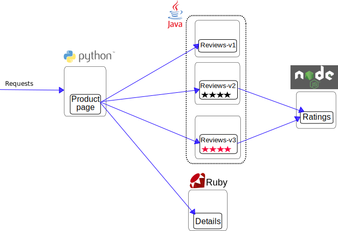

# bookinfo

# 概览

在本示例中，我们将部署一个简单的应用程序，显示书籍的信息，类似于网上书店的书籍条目。在页面上有书籍的描述、详细信息（ISBN、页数等）和书评。

BookInfo 应用程序包括四个独立的微服务：

productpage：productpage(产品页面)微服务，调用 details 和 reviews 微服务来填充页面。
details：details 微服务包含书籍的详细信息。
reviews：reviews 微服务包含书籍的点评。它也调用 ratings 微服务。
ratings：ratings 微服务包含随书评一起出现的评分信息。
有3个版本的 reviews 微服务：

版本v1不调用 ratings 服务。
版本v2调用 ratings ，并将每个评级显示为1到5个黑色星。
版本v3调用 ratings ，并将每个评级显示为1到5个红色星。
应用程序的端到端架构如下所示。



# 安装

## 安装示例程序

- 自动注入 参考istio安装章节

```
kubectl apply -f samples/bookinfo/kube/bookinfo.yaml
```

- 手动注入


## 