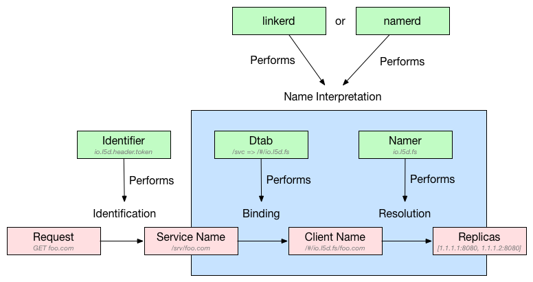

# 介绍

```
Linkerd 是一个提供弹性云端原生应用服务网格的开源项目。其核心是一个透明代理，可以用它来实现一个专用的基础设施层以提供服务间的通信，进而为软件应用提供服务发现、路由、错误处理以及服务可见性等功能，而无需侵入应用内部本身的实现。
```


# 配置文件

- admin  #管理页面
- routers  #配置接受路由请求策略
- namers   #配置服务发现策略
- telemetry #配置指标服务
- usage #使用报告

## admin

```
admin:
  ip: x.x.x.x  #管理接口绑定地址
  port: 9990  #端口
  httpIdentifierPort: xxx #调试接口
  tls:
    certPath: /certificates/certificate.pem
    keyPath: /certificates/key.pem
    requireClientAuth: false
    caCertPath: xxxx
```

## routers



```
routers:
- protocol: http #协议 http, h2, thrift, or mux
  servers:   #代理信息
  - port: 4140  # 端口
    ip: 0.0.0.0 #IP
  identifier:   #给请求赋予逻辑名称
    kind: io.l5d.header.token # io.l5d.methodAndHost，io.l5d.path，io.l5d.header，io.l5d.header.token和io.l5d.static，例如Identifer：io.l5d.header.token
  service: ...
  client: ...
  announcers: ...
  bindingCache: ...
  label: myPackIce
  dstPrefix: /walruses/http
  dtab: |
    /host                => /#/io.l5d.fs;
    /walruses/http => /host;
  originator: true
  bindingTimeoutMs: 5000
```
- io.l5d.header.token   根据 Host header 为请求命名
- io.l5d.methodAndHost  HTTP请求将使用主机头、方法和（可选）URI组合成逻辑名称
- io.l5d.path 仅基于URL的路径组件的名称，使用从HTTP路径开始的可配置数量的“/”分隔段
- io.l5d.header HTTP头值的名称。HTTP头的值被解释为一个路径，因此必须以 / 开头
- io.l5d.static 所有请求分配相同的静态名称。
- io.l5d.k8s.istio  指定到istio规则

## namer 

```
namers:
- kind: io.l5d.fs #io.l5d.fs，io.l5d.consul，io.l5d.k8s，io.l5d.marathon和 io.l5d.rewrite
  rootDir: disco
```