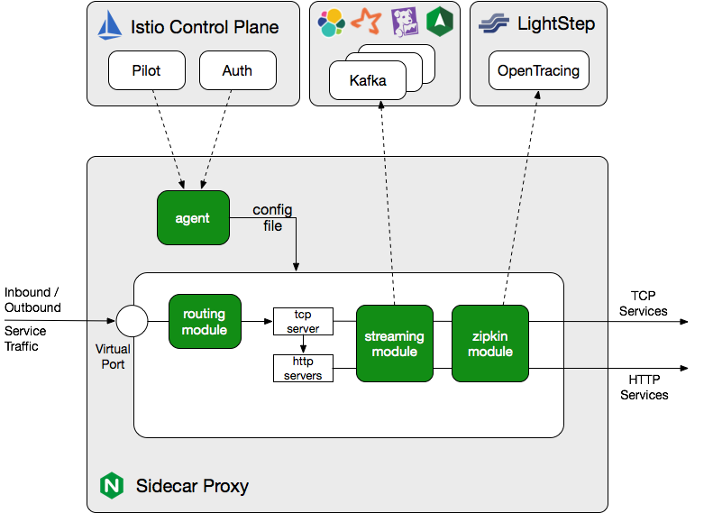

# nginx mesh

istio兼容nginxmesh作为服务网格代理

nginxmesh是基于istio 服务网格的流架构实现,当前为0.6.0版本，不能用于生产环境。

什么是service mesh,参见 [https://istio.io]( https://istio.io)

# 架构

下图讲述nginx sidecar proxy如何实现，sidecar采用nginx开源版本实现了追踪和监控功能，在当前版本，
nginxmesh 采用kafka传输指标信息到service mesh（istio）,安全功能图mtls认证在计划中即将发布。



# 安装

## 依赖

- k8s 1.9+
- 启用automatic sidecar injection 功能

## 安装istio 与nginxmesh

```
# 下载istio
curl -L https://git.io/getLatestIstio | ISTIO_VERSION=0.6.0 sh -
# 下载nginx mesh
curl -L https://github.com/nginmesh/nginmesh/releases/download/0.6.0/nginmesh-0.6.0.tar.gz | tar zx
# 部署istio
kubectl create -f istio-0.6.0/install/kubernetes/istio.yaml
# 检查istio svc是否创建
kubectl get svc  -n istio-system  
NAME            CLUSTER-IP      EXTERNAL-IP       PORT(S)                       AGE
istio-ingress   10.83.245.171   35.184.245.62     80:32730/TCP,443:30574/TCP    5h
istio-pilot     10.83.251.173   <none>            8080/TCP,8081/TCP             5h
istio-mixer     10.83.244.253   <none>            9091/TCP,9094/TCP,42422/TCP   5h

#检查pod是否正常运行
istio-ca-3657790228-j21b9           1/1       Running   0          5h
istio-ingress-1842462111-j3vcs      1/1       Running   0          5h
istio-pilot-2275554717-93c43        1/1       Running   0          5h
istio-mixer-2104784889-20rm8        2/2       Running   0          5h

#安装nginxmesh sidecar
kubectl get namespace -L istio-injection
```
